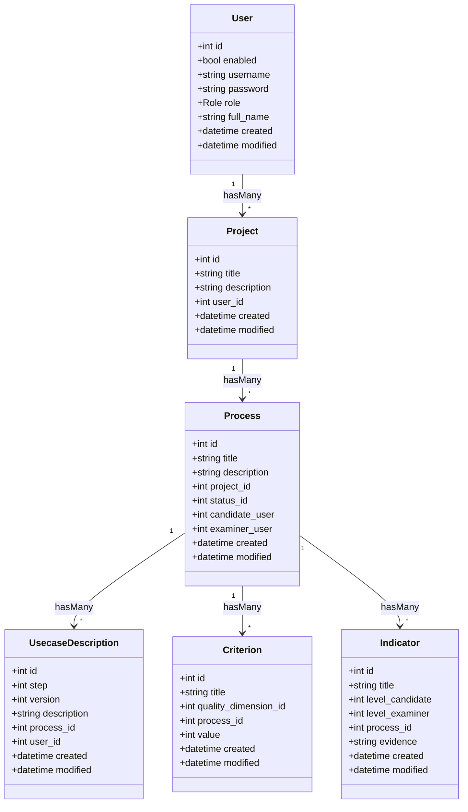

# MISSION KI Prüfportal

A web-based platform for conducting and managing AI system quality assessments according to the MISSION KI quality standard. It digitalizes the entire assessment process from use case description to certificate generation.

## Quick Start

Start the application with Docker:

```bash
make start
```

The application will be available at http://localhost:8070.

To stop the server:

```bash
make stop
```

## Development

### Installing Dependencies

If you need to install or update PHP dependencies (e.g., after pulling new changes):

```bash
make install
```

This runs `composer install` inside the Docker container.

### Common Commands

#### Application Management

```bash
make start              # Start with seeding
make start-without-seed # Start without seeding
make stop               # Stop all services
make exec               # Access container shell
make shell              # Access container shell (alias)
```

#### Database Commands

```bash
make migrate    # Run migrations
make seed       # Run seeds
make setup      # Migrate + seed
make reset      # Reset database (rollback + migrate + seed)
make reset-db   # Hard reset via script
```

#### Code Quality

```bash
make test       # Run PHPUnit tests
make check      # Run tests + code style check
make cs-check   # Check code style
make cs-fix     # Fix code style issues
```

### Frontend Development

#### Build Commands

- `npm run build` - Builds both CSS and JavaScript assets for production
- `npm run build:css` - Compiles and prefixes CSS
- `npm run build:js` - Bundles JavaScript for production

#### Development

- `npm start` or `npm run dev` - Starts the development server with hot-reloading
- `npm run watch:css` - Watches SCSS files and recompiles on changes
- `npm run watch:js` - Watches JavaScript files and rebuilds on changes

#### CSS Processing

- `npm run css` - Compiles and prefixes CSS
- `npm run css-compile` - Compiles SCSS to CSS
- `npm run css-prefix` - Adds vendor prefixes to CSS
- `npm run css-lint` - Lints SCSS files

#### Testing

- `npm test` - Runs all tests including CSS linting

### PHPUnit Testing

Run unit tests for the data model layer:

```bash
# Run model tests only (recommended for development)
make unit-test

# Run all PHPUnit tests
make unit-test-all
```

Or run directly via Docker:

```bash
# Model tests with testdox output
docker exec -it mission-ki-php bash -c "cd /app && php vendor/bin/phpunit tests/TestCase/Model/ --testdox"

# Run a specific test file
docker exec -it mission-ki-php bash -c "cd /app && php vendor/bin/phpunit tests/TestCase/Model/Table/UsersTableTest.php --testdox"
```

### Cypress E2E Testing

- `npm run cy:open` - Opens Cypress test runner
- `npm run cy:run` - Runs all Cypress tests headlessly
- `npm run cy:smoke` - Runs smoke tests
- `npm run cy:regression` - Runs regression tests

#### Known Issues

**esbuild Platform Mismatch on Apple Silicon (M1/M2/M3)**

If you encounter the error `"@esbuild/darwin-arm64" package is present but this platform needs the "@esbuild/darwin-x64" package instead` when running Cypress:

**Root Cause:** Cypress 15.3.0 bundles only the ARM64 esbuild package, but x86_64 Node (running under Rosetta) needs the x64 variant to load TypeScript config files.

**Solution:**
1. Use Node 22 LTS (project already configured with `.nvmrc`)
2. Manually add the missing esbuild package to Cypress cache:
   ```bash
   cd /tmp && npm pack @esbuild/darwin-x64@0.25.9
   tar -xzf esbuild-darwin-x64-*.tgz
   cp -r package ~/Library/Caches/Cypress/15.3.0/Cypress.app/Contents/Resources/app/node_modules/@esbuild/darwin-x64
   ```

**Note:** This fix needs to be reapplied after running `npx cypress cache clear` or upgrading Cypress.

**Alternative:** Convert `cypress.config.ts` to `cypress.config.js` to avoid the esbuild dependency entirely.

### Static Analysis

```bash
# PHPStan (level 8)
vendor/bin/phpstan analyse

# Psalm (level 2)
vendor/bin/psalm
```

## Optional Services (Docker Compose Profiles)

Additional services can be enabled using Docker Compose profiles:

```bash
# Start with MinIO (S3-compatible storage)
docker compose --profile minio up

# Start with multiple profiles
docker compose --profile minio --profile mailpit up
```

| Profile   | Service | Purpose                        | Ports                      |
|-----------|---------|--------------------------------|----------------------------|
| `minio`   | MinIO   | S3-compatible object storage   | 9000 (API), 9001 (Console) |
| `mailpit` | Mailpit | Local email testing            | 8025 (UI), 1025 (SMTP)     |

### Storage Configuration

The application supports pluggable storage backends:

| Driver  | Use Case                    | Setup                                              |
|---------|-----------------------------|----------------------------------------------------|
| `local` | Development (default)       | No setup required                                  |
| `s3`    | Production or S3 testing    | Set S3 env vars, optionally use `--profile minio`  |

```bash
# Default: local storage
docker compose up

# MinIO for S3-compatible testing
docker compose --profile minio up
# Then set in .env: STORAGE_DRIVER=s3, S3_ENDPOINT=http://minio:9000, etc.

# AWS S3 (production)
# Set in .env: STORAGE_DRIVER=s3, S3_BUCKET_NAME_ATTACHMENTS=..., AWS credentials
docker compose up
```

## Database

### Database Seeding

CakePHP provides a seeding system to populate your database with initial or test data.

#### Creating Seeders

1. Seeders are located in `config/Seeds/`
2. Each table should have its own seeder class (e.g., `UsersSeed.php`)
3. Seeders extend `App\Seed\AppSeed`

#### Running Seeders

```bash
# Run all seeders
bin/cake migrations seed

# Run a specific seeder
bin/cake migrations seed --seed=UsersSeed
```

### Data Model

#### Entity Relationship Diagram



#### Quality Dimensions

The MISSION KI quality standard defines 6 quality dimensions:

| ID | Code | Name                                  |
|----|------|---------------------------------------|
| 10 | CY   | KI-spezifische Cybersicherheit        |
| 20 | TR   | Transparenz                           |
| 30 | ND   | Nicht-Diskriminierung                 |
| 40 | VE   | Verlässlichkeit                       |
| 50 | DA   | Datenqualität, -schutz und -Governance|
| 60 | MA   | Menschliche Aufsicht und Kontrolle    |

## Environment Variables

The application uses CakePHP's `env()` function to read environment variables with fallback defaults.

### Environment Files

| Environment | File                    | Purpose                                    |
|-------------|-------------------------|--------------------------------------------|
| Local Dev   | `backend/.env`          | Local development (copy from `.env.example`) |

**Note:** `.env` files are gitignored. Only `.env.example` is committed as a template.

### Variable Reference

#### Database

| Variable       | Default              | Description                               |
|----------------|----------------------|-------------------------------------------|
| `DB_NAME`      | `mission_ki_db`      | Database name                             |
| `DB_USER`      | `mission_ki_user`    | Database username                         |
| `DB_PASSWORD`  | `mission_ki_password`| Database password                         |
| `DB_HOST`      | `db`                 | Database host (`db` for Docker)           |
| `DB_PORT`      | `5432`               | Database port                             |
| `DATABASE_URL` | `null`               | Full connection URL (alternative)         |

#### Application

| Variable              | Default    | Description                                  |
|-----------------------|------------|----------------------------------------------|
| `DEBUG`               | `true`     | Enable debug mode and error display          |
| `SECURITY_SALT`       | —          | **Required.** Random 64-char string          |
| `APP_DEFAULT_LOCALE`  | `en_US`    | Default locale (use `de_DE` for German)      |
| `APP_DEFAULT_TIMEZONE`| `UTC`      | Default timezone (use `Europe/Berlin`)       |

#### Storage

| Variable                    | Default           | Description                           |
|-----------------------------|-------------------|---------------------------------------|
| `STORAGE_DRIVER`            | `local`           | Storage backend: `local` or `s3`      |
| `STORAGE_LOCAL_PATH`        | `storage/uploads` | Path for local file storage           |
| `S3_BUCKET_NAME_ATTACHMENTS`| —                 | S3 bucket name for file uploads       |
| `S3_ACCESS_KEY_ID`          | —                 | AWS access key for S3                 |
| `S3_SECRET_ACCESS_KEY`      | —                 | AWS secret key for S3                 |
| `S3_ENDPOINT`               | —                 | Custom S3 endpoint (for MinIO)        |
| `AWS_DEFAULT_REGION`        | `eu-central-1`    | AWS region                            |

#### Email

| Variable              | Default       | Description                         |
|-----------------------|---------------|-------------------------------------|
| `EMAIL_DRIVER`        | `ses`         | Email backend: `ses` or `smtp`      |
| `SES_REGION`          | `eu-west-1`   | AWS SES region                      |
| `SES_ACCESS_KEY_ID`   | —             | AWS access key for SES              |
| `SES_SECRET_ACCESS_KEY`| —            | AWS secret key for SES              |
| `SES_SENDER_EMAIL`    | —             | Default sender email address        |
| `SES_SENDER_NAME`     | `Prüfportal`  | Default sender display name         |
| `SMTP_HOST`           | `localhost`   | SMTP server hostname                |
| `SMTP_PORT`           | `1025`        | SMTP server port                    |

### Adding a New Environment Variable

1. **Add to `.env.example`** with a placeholder or default value
2. **Use in code** with `env('VAR_NAME', 'default')`
3. **Document** in this README

### Best Practices

1. **Never commit secrets** — `.env` files are gitignored
2. **Use descriptive names** — `S3_BUCKET_NAME_ATTACHMENTS` not `BUCKET`
3. **Provide sensible defaults** — Development should work without configuration
4. **Use type casting** — Boolean values need `filter_var(..., FILTER_VALIDATE_BOOLEAN)`

## Release Process

This project follows a git-flow workflow for managing releases and hotfixes.

### Creating a Release

```bash
npm run release:start   # Start new release (minor version bump)
npm run release:finish  # Finish release (merge to main, create tag)
```

### Creating a Hotfix

```bash
npm run hotfix:start    # Start new hotfix (patch version bump)
npm run hotfix:finish   # Finish hotfix (merge to main, create tag)
```

## Dependencies

- **Backend:** CakePHP 5.2, PHP 8.1+, PostgreSQL
- **Frontend:** Bootstrap 5.3.7, Webpack, SASS, PostCSS, Stylelint

## License

See [LICENSE](LICENSE) file.
